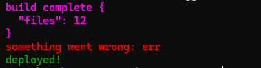

## log-it-colored

Miniature ready-to-use console logger that just writes in a given color

GitHub Repository: [github.com/mirasayon/log-it-colored](https://github.com/mirasayon/log-it-colored/)

NPM package url: [www.npmjs.com/package/log-it-colored](https://www.npmjs.com/package/log-it-colored)

### Install

_IMPORTANT:_ This package is `ESM`-only

with `npm`

```bash
npm install log-it-colored
```

### Usage

```ts
import { Logger } from "log-it-colored";

Logger.violet("build complete", { files: 12 });
Logger.red("something went wrong:", "err");
Logger.success("deployed!");
```

result:


